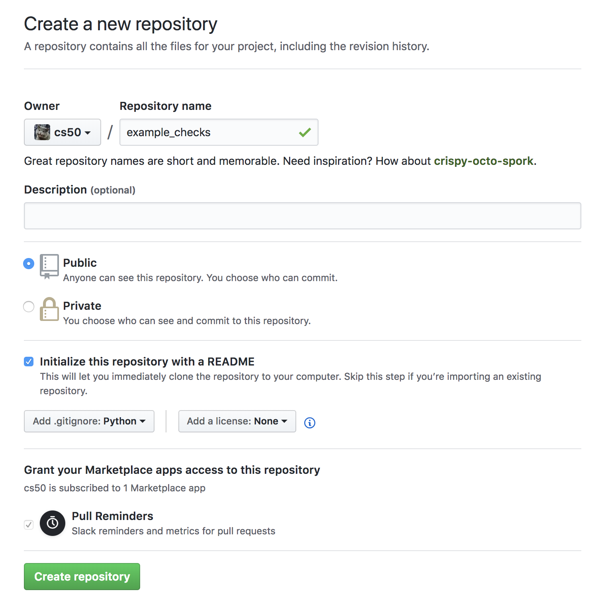

# check50 [](https://www.travis-ci.org/cs50/check50)

Check50 is a testing tool for checking student code. As a student you can use check50 to check your CS50 problem sets or any other Problem sets for which check50 checks exist. Check50 allows teachers to automatically grade code on correctness and to provide automatic feedback while students are coding.

## Installation
First make sure you have Python 3.6 or higher installed. You can download Python [here](https://www.python.org/downloads/).

Check50 has a dependency on git, please make sure to [install git](https://git-scm.com/book/en/v2/Getting-Started-Installing-Git) if git is not already installed.

To install check50 under Linux / OS X:

    pip install check50

Under Windows, please [install the Linux subsystem](https://docs.microsoft.com/en-us/windows/wsl/install-win10). Then install check50 within the subsystem.

## Checks
In Check50 the actual checks are decoupled from the tool. You can find CS50's set of checks for CS50 problem sets at [/cs50/checks](https://github.com/cs50/checks). If you would like to develop your own set of checks such that you can use check50 in your own course [jump to writing checks](#writing-checks).

Under the hood, checks are naked Python functions decorated with the ``` @check50.check``` decorator. Check50 exposes several functions, [documented below](#docs), that allow you to easily write checks for input/output testing. Check50 comes with two builtin extensions: `c` and `flask`. These extensions add extra functionality for C and Python's Flask framework to check50's core.

By design check50 is extensible. If you want to add support for other programming languages / frameworks and you are comfortable with Python please [check out writing extensions](#writing-extensions).

## Usage

## Docs

`check50.check`

`check50.exists`

`check50.run`

`check50.Process.stdin`

`check50.Process.stdout`

`check50.Process.exit`

`check50.Process.reject`

`check50.Process.kill`

`check50.Failure`

`check50.Mismatch`

`check50.diff`

`check50.hash`

`check50.log`

`check50.include`

`check50.import_checks`

## Writing checks
Check50 checks live in a git repo on Github. Check50 finds the git repo based on the slug that is passed to check50. For instance, consider the following execution of check50:

    check50 cs50/problems/2018/x/hello

Check50 will look for an owner called `cs50`, a repo called `problems`, a branch called `2018` or `2018/x` and a problem called `x/hello` or `hello`. The slug is thus parsed like so:

    check50 <owner>/<repo>/<branch>/<problem>

### Creating a git repo
To get you started, the first thing you need to do is [register with Github](https://github.com/join). Once you have done so, or if you already have an account with Github, [create a new git repo](https://github.com/new). Make sure to think of a good name for your repo, as this is what students will be typing. Also make sure your repo is set to public, it is initialised with a README, and finally add a Python `.gitignore`. Ultimately you should have something looking like this:



### Creating a check and running it

Your new repo should live at `https://github.com/<user>/<repo>`, which is `https://github.com/cs50/example_checks` in our example. Once you have created your new repo, create a new file by clicking the `Create new file` button:


Then continue by creating the following `.check50.yaml` file. All indentation is done by 2 spaces, as per `.yaml` syntax.


Or in text, if you want to quickly copy-paste:

```YAML
checks:
  hello world:
    - run: python3 hello.py
      stdout: Hello, world!
      exit: 0
```

Note that you should create a directory like in the example above by typing: `example/.check50.yaml`. Once you have populated the file with the code above. Scroll down the page and hit the commit button:


That's it! You know have a repo that check50 can use to check whether a python file called `hello.py` prints `Hello, world!` and exits with a `0` as exit code. To try it, simply execute:

    check50 <owner>/<repo>/master/example --local

Where you substitute `<owner>` for your own username, `<repo>` for the repo you've just created. Given that a file called `hello.py` is in your current working directory, and it actually prints `Hello, world!` when run, you should now see the following:

    :) hello world

### Simple YAML checks
To get you started, and to cover the basics of input/output checking, check50 lets you write simple checks in YAML syntax. Under the hood, check50 compiles these YAML checks to Python checks that check50 then runs.

YAML checks in check50 all live in `.check50.yaml` and start with a top-level record called `checks`. The `checks` record contains all checks, where the name of the check is the name of the YAML record. Like so:

```YAML
checks:
  hello world: # define a check named hello world
    # check code
  foo: # define a check named foo
    # check code
  bar: # define a check named bar
    # check code
```

This code snippet defines three checks, named `hello world`, `foo` and `bar` respectively. These checks should contain a list of `run` records, that can each contain a combination of `stdin`, `stdout` and `exit`. See below:

```YAML
checks:
  hello world:
    - run: python3 hello.py # run python3 hello.py
      stdout: Hello, world! # expect Hello, world! in stdout
      exit: 0 # expect program to exit with exitcode 0
  foo:
    - run: python3 foo.py # run python3 foo.py
      stdin: baz # insert baz into stdin
      stdout: baz # expect baz in stdout
      exit: 0 # expect program to exit with exitcode 0
  bar:
    - run: python3 bar.py # run python3 bar.py
      stdin: baz # insert baz into stdin
      stdout: bar baz # expect bar baz in stdout
    - run: python3 bar.py # run python3 bar.py
      stdin:
        - baz # insert baz into stdin
        - qux # insert qux into stdin
      stdout:
        - bar baz # first expect bar baz in stdout
        - bar qux # then expect bar qux in stdout
```

The code snippet above again defines three checks: `hello world`, `foo` and `bar`.

The `hello world` check runs `python3 hello.py` in the terminal, expects `Hello, world!` to be outputted in stdout, and then expects the program to exit with exitcode 0.

The `foo` check runs `python3 foo.py` in the terminal, inserts `baz` into `stdin`, expects `baz` to be outputted in stdout, and finally expects the program to exit with exitcode 0.

The `bar` check runs two commands in order in the terminal. First `python3 bar.py` gets run, `baz` gets put in `stdin` and `bar baz` is expected in stdout. There is no mention of `exit` here, so the exitcode is not checked. Secondly, `python3 bar.py` gets run, `baz` and `qux` get put into stdin, and first `bar baz` is expected in stdout, then `bar qux`.

We encourage you to play around with the example above by copying its code to your checks git repo. Then try to write a `bar.py` and `foo.py` that make you pass these tests.

In case you want to check for multiline input, you can make use of YAML's `|` operator like so:

```YAML
checks:
  multiline hello world:
    run: python3 multi_hello.py
    stdout: | # expect Hello\nWorld! in stdout
      Hello
      World!
    exit: 0
```

### Python checks
If you need a little more than strict input / output testing, check50 lets you write checks in Python. A good starting point is the result of the compilation of the `YAML` checks.

## Writing extensions

### check50.internal
