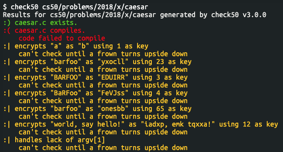
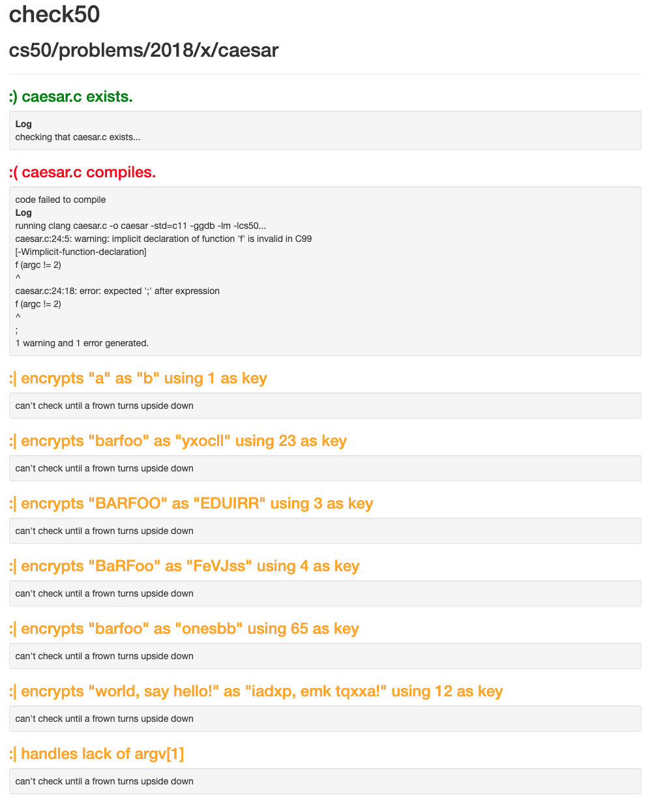

.. _check50_user:

Running check50
======================

Slug
**********************
check50 requires one positional argument, a so called slug. Something like this:

.. code-block:: bash

    check50 cs50/problems/2018/x/caesar

Why? Well, anyone can write checks for check50 without needing to ask for permission. To achieve this goal check50, the tool, is decoupled from any of its checks. The checks themselves are hosted anywhere on a popular hosting platform for code, GitHub. All you need to do to add your own checks is to put them on anywhere on GitHub. With this flexibility comes a price, as check50 does not know where your checks live on GitHub. In order to uniquely identify a collection of checks on GitHub check50 needs the following:

* org
* repository
* branch
* path to problem

These four pieces of information separated by a / is what check50 calls a slug, a string that uniquely identifies a set of checks. For instance the slug :code:`cs50/problems/2018/x/caesar` uniquely identifies the org :code:`cs50`, the repository :code:`problems`, the branch :code:`2018/x` and the path :code:`caesar`.

Operation modes
**********************
Check50 can run in four mutually exclusive modes of operation.

**********************
local
**********************
By default check50 runs locally. That means the checks run locally on the machine you run check50 on. The checks however are fetched remotely from GitHub.

**********************
offline
**********************
Running with :code:`--offline` runs the checks locally and has check50 look for checks locally. check50 will not try to fetch checks remotely in this mode.

**********************
online
**********************
Running with :code:`--online` runs the checks remotely and then waits for the results to come back.

**********************
dev
**********************
The :code:`--dev` flag signals check50 to run in developer mode. This implies :code:`--offline`. More on this mode in :ref:`check_writer`.

Additional output
**********************
By default check50 will try to keep its output concise in its :code:`ansi` output mode. For each check you will see at most its description and rationale/help on why the check failed. check50 will by default hide tracebacks and log output. You can show both by running check50 with the :code:`--verbose` flag, or just the log with the :code:`--log` flag.

**********************
verbose
**********************
Running with :code:`--verbose` lets check50 output both the log and any tracebacks in the :code:`ansi` output mode.

**********************
log
**********************
Running check50 with :code:`--log` will have check50 print out its logs.

Targeting checks
**********************
Check50 lets you target specific checks by name with the :code:`--target` flags. This will have check50 run just these checks and their dependencies.

**********************
target
**********************
With :code:`--target` you can target checks from a larger body of checks by name. check50 will only run and show these checks and their dependencies. 

Output modes
**********************
check50 supports three output modes: :code:`ansi`, :code:`html` and :code:`json`. In short, the :code:`ansi` output mode is text-based output meant to be displayed in a terminal. :code:`html` is an extension of :code:`ansi` showing the same results but in a webpage. This allows for visual comparisons and more information to be displayed in general. Finally, the :code:`json` output mode provides a machine readable form of output, that can for instance be used for automatic grading.

The output modes can be mixed and matched through the :code:`--output` or :code:`-o` flag.

.. code-block:: bash

    check50 <slug> -o ansi
    check50 <slug> -o ansi html # equivalent to check50 <slug>
    check50 <slug> -o json

By default check50 shows both :code:`ansi` and :code:`html` output.

**********************
ansi
**********************
The :code:`ansi` output mode will have check50 print the results from the checks to stdout. This output mode keeps students in the terminal, the environment in which they are running check50 in the first place. Limited by its nature, check50's :code:`ansi` output mode is not suited for large pieces of text or visual comparisons. The output format is sufficient for showing which checks passed and failed, and offering short text based help or explanation on those checks.

**********************
html
**********************
In addition to :code:`ansi`, check50 comes with a :code:`html` output mode. This output mode allows check50 to show results side by side and to display more verbose information like the log by default. check50 creates a local self contained static html file in :code:`/tmp` and will output the path to file in stdout.

**********************
json
**********************
check50 can provide machine readable output in the form of :code:`json`. By default this output mode will print to stdout, but like any other form of output check50 can write to a file with the :code:`--output-file` command line option. For a complete overview of the :code:`json` output please refer to the :ref:`json_specification`.

.. code-block:: json

    {
        "slug": "cs50/problems/2018/x/caesar",
        "results": [
            {
                "name": "exists",
                "description": "caesar.c exists.",
                "passed": true,
                "log": [
                    "checking that caesar.c exists..."
                ],
                "cause": null,
                "data": {},
                "dependency": null
            },
            {
                "name": "compiles",
                "description": "caesar.c compiles.",
                "passed": false,
                "log": [
                    "running clang caesar.c -o caesar -std=c11 -ggdb -lm -lcs50...",
                    "caesar.c:24:5: warning: implicit declaration of function 'f' is invalid in C99",
                    "      [-Wimplicit-function-declaration]",
                    "    f (argc != 2)",
                    "    ^",
                    "caesar.c:24:18: error: expected ';' after expression",
                    "    f (argc != 2)",
                    "                 ^",
                    "                 ;",
                    "1 warning and 1 error generated."
                ],
                "cause": {
                    "rationale": "code failed to compile",
                    "help": null
                },
                "data": {},
                "dependency": "exists"
            },
            {
                "name": "encrypts_a_as_b",
                "description": "encrypts \"a\" as \"b\" using 1 as key",
                "passed": null,
                "log": [],
                "cause": {
                    "rationale": "can't check until a frown turns upside down"
                },
                "data": {},
                "dependency": "compiles"
            },
            {
                "name": "encrypts_barfoo_as_yxocll",
                "description": "encrypts \"barfoo\" as \"yxocll\" using 23 as key",
                "passed": null,
                "log": [],
                "cause": {
                    "rationale": "can't check until a frown turns upside down"
                },
                "data": {},
                "dependency": "compiles"
            },
            {
                "name": "encrypts_BARFOO_as_EDUIRR",
                "description": "encrypts \"BARFOO\" as \"EDUIRR\" using 3 as key",
                "passed": null,
                "log": [],
                "cause": {
                    "rationale": "can't check until a frown turns upside down"
                },
                "data": {},
                "dependency": "compiles"
            },
            {
                "name": "encrypts_BaRFoo_FeVJss",
                "description": "encrypts \"BaRFoo\" as \"FeVJss\" using 4 as key",
                "passed": null,
                "log": [],
                "cause": {
                    "rationale": "can't check until a frown turns upside down"
                },
                "data": {},
                "dependency": "compiles"
            },
            {
                "name": "encrypts_barfoo_as_onesbb",
                "description": "encrypts \"barfoo\" as \"onesbb\" using 65 as key",
                "passed": null,
                "log": [],
                "cause": {
                    "rationale": "can't check until a frown turns upside down"
                },
                "data": {},
                "dependency": "compiles"
            },
            {
                "name": "checks_for_handling_non_alpha",
                "description": "encrypts \"world, say hello!\" as \"iadxp, emk tqxxa!\" using 12 as key",
                "passed": null,
                "log": [],
                "cause": {
                    "rationale": "can't check until a frown turns upside down"
                },
                "data": {},
                "dependency": "compiles"
            },
            {
                "name": "handles_no_argv",
                "description": "handles lack of argv[1]",
                "passed": null,
                "log": [],
                "cause": {
                    "rationale": "can't check until a frown turns upside down"
                },
                "data": {},
                "dependency": "compiles"
            }
        ],
        "version": "3.0.0"
    }
