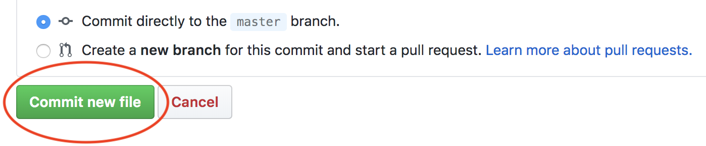

.. _check_writer:

Writing check50 checks
======================

Check50 checks live in a git repo on Github. Check50 finds the git repo based on the slug that is passed to check50. For instance, consider the following execution of check50:

.. code-block:: bash

    check50 cs50/problems/2018/x/hello

Check50 will look for an owner called `cs50`, a repo called `problems`, a branch called `2018` or `2018/x` and a problem called `x/hello` or `hello`. The slug is thus parsed like so:

.. code-block:: bash

    check50 <owner>/<repo>/<branch>/<problem>

Creating a git repo
*******************

To get you started, the first thing you need to do is |register_github|. Once you have done so, or if you already have an account with Github, |create_repo|. Make sure to think of a good name for your repo, as this is what students will be typing. Also make sure your repo is set to public, it is initialised with a `README`, and finally add a Python `.gitignore`. Ultimately you should have something looking like this:

.. |register_github| raw:: html

   <a href="https://github.com/join" target="_blank">register with Github</a>

.. |create_repo| raw:: html

   <a href="https://github.com/new" target="_blank">create a new git repo</a>

.. image:: img/repo.png

Creating a check and running it
*******************************

Your new repo should live at ``https://github.com/<user>/<repo>``, which is ``https://github.com/cs50/example_checks`` in our example. Once you have created your new repo, create a new file by clicking the `Create new file` button:

.. image:: img/new_file.png

Then continue by creating the following `.check50.yaml` file. All indentation is done by 2 spaces, as per YAML syntax.

.. image:: img/new_yaml.png

Or in text, if you want to quickly copy-paste:

.. code-block:: yaml

    checks:
      hello world:
        - run: python3 hello.py
          stdout: Hello, world!
          exit: 0

Note that you should create a directory like in the example above by typing: `example/.check50.yaml`. Once you have populated the file with the code above. Scroll down the page and hit the commit button:

That's it! You know have a repo that check50 can use to check whether a python file called `hello.py` prints ``Hello, world!`` and exits with a ``0`` as exit code. To try it, simply execute:

.. code-block:: bash

    check50 <owner>/<repo>/master/example --local

Where you substitute `<owner>` for your own username, `<repo>` for the repo you've just created. Given that a file called `hello.py` is in your current working directory, and it actually prints ``Hello, world!`` when run, you should now see the following:

.. code-block:: bash

    :) hello world

Simple YAML checks
******************

To get you started, and to cover the basics of input/output checking, check50 lets you write simple checks in YAML syntax. Under the hood, check50 compiles these YAML checks to Python checks that check50 then runs.

YAML checks in check50 all live in `.check50.yaml` and start with a top-level record called ``checks``. The ``checks`` record contains all checks, where the name of the check is the name of the YAML record. Like so:

.. code-block:: yaml

    checks:
      hello world: # define a check named hello world
        # check code
      foo: # define a check named foo
        # check code
      bar: # define a check named bar
        # check code

This code snippet defines three checks, named ``hello world``, ``foo`` and ``bar`` respectively. These checks should contain a list of ``run`` records, that can each contain a combination of ``stdin``, ``stdout`` and ``exit``. See below:

.. code-block:: yaml

    checks:
      hello world:
        - run: python3 hello.py # run python3 hello.py
          stdout: Hello, world! # expect Hello, world! in stdout
          exit: 0 # expect program to exit with exitcode 0
      foo:
        - run: python3 foo.py # run python3 foo.py
          stdin: baz # insert baz into stdin
          stdout: baz # expect baz in stdout
          exit: 0 # expect program to exit with exitcode 0
      bar:
        - run: python3 bar.py # run python3 bar.py
          stdin: baz # insert baz into stdin
          stdout: bar baz # expect bar baz in stdout
        - run: python3 bar.py # run python3 bar.py
          stdin:
            - baz # insert baz into stdin
            - qux # insert qux into stdin
          stdout:
            - bar baz # first expect bar baz in stdout
            - bar qux # then expect bar qux in stdout

The code snippet above again defines three checks: `hello world`, `foo` and `bar`.

The ``hello world`` check runs ``python3 hello.py`` in the terminal, expects ``Hello, world!`` to be outputted in stdout, and then expects the program to exit with exitcode ``0``.

The ``foo`` check runs ``python3 foo.py`` in the terminal, inserts ``baz`` into stdin, expects ``baz`` to be outputted in stdout, and finally expects the program to exit with exitcode ``0``.

The ``bar`` check runs two commands in order in the terminal. First ``python3 bar.py`` gets run, ``baz`` gets put in stdin and ``bar baz`` is expected in stdout. There is no mention of ``exit`` here, so the exitcode is not checked. Secondly, ``python3 bar.py`` gets run, ``baz`` and ``qux`` get put into stdin, and first ``bar baz`` is expected in stdout, then ``bar qux``.

We encourage you to play around with the example above by copying its code to your checks git repo. Then try to write a `bar.py` and `foo.py` that make you pass these tests.

In case you want to check for multiline input, you can make use of YAML's ``|`` operator like so:

.. code-block:: yaml

    checks:
      multiline hello world:
        - run: python3 multi_hello.py
          stdout: | # expect Hello\nWorld!\n in stdout
            Hello
            World!
          exit: 0

Developing locally
******************

To write checks on your own machine, rather than on the Github webpage, you can clone the repo via:

.. code-block:: bash

    git clone https://github.com/<owner>/<repo>

Where ``<owner>`` is your Github username, and ``<repo>`` is the name of your checks repository. Head on over to the new directory git just created, and open up `.check50.yaml` with your favorite editor.

Now you're all set to write new checks locally. Just remember to ``git add``, ``git commit`` and ``git push`` when you're done writing checks. Quick refresher:

.. code-block:: bash

    git add .check50.yaml
    git commit -m "wrote some awesome new checks!"
    git push

Python checks
*************

If you need a little more than strict input / output testing, check50 lets you write checks in Python. A good starting point is the result of the compilation of the YAML checks.
