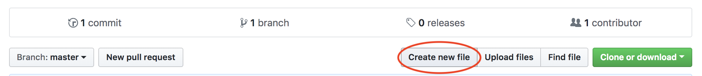
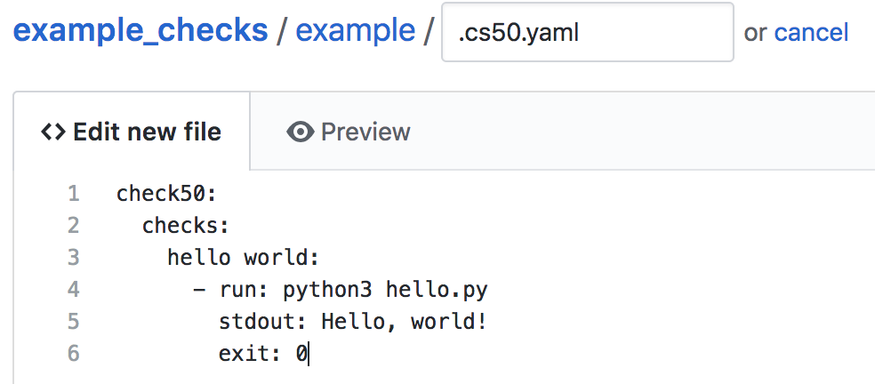

.. _check_writer:

Writing check50 checks
======================

check50 checks live in a git repo on Github. check50 finds the git repo based on the slug that is passed to check50. For instance, consider the following execution of check50:

.. code-block:: bash

    check50 cs50/problems/2018/x/hello

check50 will look for an owner called `cs50`, a repo called `problems`, a branch called `2018` or `2018/x` and a problem called `x/hello` or `hello`. The slug is thus parsed like so:

.. code-block:: bash

    check50 <owner>/<repo>/<branch>/<problem>

Creating a git repo
*******************

To get you started, the first thing you need to do is |register_github|. Once you have done so, or if you already have an account with Github, |create_repo|. Make sure to think of a good name for your repo, as this is what students will be typing. Also make sure your repo is set to public, it is initialised with a `README`, and finally add a Python `.gitignore`. Ultimately you should have something looking like this:

.. |register_github| raw:: html

   <a href="https://github.com/join" target="_blank">register with Github</a>

.. |create_repo| raw:: html

   <a href="https://github.com/new" target="_blank">create a new git repo</a>

.. image:: repo.png

Creating a check and running it
*******************************

Your new repo should live at ``https://github.com/<user>/<repo>``, that is ``https://github.com/cs50/example_checks`` in our example. Once you have created your new repo, create a new file by clicking the `Create new file` button:

Then continue by creating the following `.cs50.yaml` file. All indentation is done by 2 spaces, as per YAML syntax.

Or in text, if you want to quickly copy-paste:

.. code-block:: yaml
    :linenos:
    :caption: **.cs50.yaml**

    check50:
      checks:
        hello world:
          - run: python3 hello.py
            stdout: Hello, world!
            exit: 0

Note that you should create a directory like in the example above by typing: `example/.cs50.yaml`. Once you have populated the file with the code above. Scroll down the page and hit the commit button:

.. image:: commit.png

That's it! You know have a repo that check50 can use to check whether a python file called `hello.py` prints ``Hello, world!`` and exits with a ``0`` as exit code. To try it, simply execute:

.. code-block:: bash

    check50 <owner>/<repo>/master/example --local

Where you substitute `<owner>` for your own username, `<repo>` for the repo you've just created. Given that a file called `hello.py` is in your current working directory, and it actually prints ``Hello, world!`` when run, you should now see the following:

.. code-block:: bash

    :) hello world

Simple YAML checks
******************

To get you started, and to cover the basics of input/output checking, check50 lets you write simple checks in YAML syntax. Under the hood, check50 compiles these YAML checks to Python checks that check50 then runs.

YAML checks in check50 all live in `.cs50.yaml` and start with a top-level key called ``check50``, that specifies a ``checks``. The ``checks`` record contains all checks, where the name of the check is the name of the YAML record. Like so:

.. code-block:: yaml
    :linenos:
    :caption: **.cs50.yaml**

    check50:
      checks:
        hello world: # define a check named hello world
          # check code
        foo: # define a check named foo
          # check code
        bar: # define a check named bar
          # check code

This code snippet defines three checks, named ``hello world``, ``foo`` and ``bar`` respectively. These checks should contain a list of ``run`` records, that can each contain a combination of ``stdin``, ``stdout`` and ``exit``. See below:

.. code-block:: yaml
    :linenos:
    :caption: **.cs50.yaml**

    check50:
      checks:
        hello world:
          - run: python3 hello.py # run python3 hello.py
            stdout: Hello, world! # expect Hello, world! in stdout
            exit: 0 # expect program to exit with exitcode 0
        foo:
          - run: python3 foo.py # run python3 foo.py
            stdin: baz # insert baz into stdin
            stdout: baz # expect baz in stdout
            exit: 0 # expect program to exit with exitcode 0
        bar:
          - run: python3 bar.py # run python3 bar.py
            stdin: baz # insert baz into stdin
            stdout: bar baz # expect bar baz in stdout
          - run: python3 bar.py # run python3 bar.py
            stdin:
              - baz # insert baz into stdin
              - qux # insert qux into stdin
            stdout:
              - bar baz # first expect bar baz in stdout
              - bar qux # then expect bar qux in stdout

The code snippet above again defines three checks: `hello world`, `foo` and `bar`.

The ``hello world`` check runs ``python3 hello.py`` in the terminal, expects ``Hello, world!`` to be outputted in stdout, and then expects the program to exit with exitcode ``0``.

The ``foo`` check runs ``python3 foo.py`` in the terminal, inserts ``baz`` into stdin, expects ``baz`` to be outputted in stdout, and finally expects the program to exit with exitcode ``0``.

The ``bar`` check runs two commands in order in the terminal. First ``python3 bar.py`` gets run, ``baz`` gets put in stdin and ``bar baz`` is expected in stdout. There is no mention of ``exit`` here, so the exitcode is not checked. Secondly, ``python3 bar.py`` gets run, ``baz`` and ``qux`` get put into stdin, and first ``bar baz`` is expected in stdout, then ``bar qux``.

We encourage you to play around with the example above by copying its code to your checks git repo. Then try to write a `bar.py` and `foo.py` that make you pass these tests.

In case you want to check for multiline input, you can make use of YAML's ``|`` operator like so:

.. code-block:: yaml
    :linenos:
    :caption: **.cs50.yaml**

    check50:
      checks:
        multiline hello world:
          - run: python3 multi_hello.py
            stdout: | # expect Hello\nWorld!\n in stdout
              Hello
              World!
            exit: 0

Developing locally
******************

To write checks on your own machine, rather than on the Github webpage, you can clone the repo via:

.. code-block:: bash

    git clone https://github.com/<owner>/<repo>

Where ``<owner>`` is your Github username, and ``<repo>`` is the name of your checks repository. Head on over to the new directory that git just created, and open up `.cs50.yaml` with your favorite editor.

To run the cloned checks locally, check50 comes with a ``--dev`` mode. That will let you target a local checks repo, rather than a github repo. So if your checks live in ``/Users/cs50/Documents/example_checks``, you would execute check50 like so:

.. code-block:: bash

    check50 --dev /Users/cs50/Documents/example_checks/example

This runs the `example` check from ``/Users/cs50/Documents/example_checks``. You can also specify a relative path, so if your current working directory is ``/Users/cs50/Documents/solutions``, you can execute check50 like so:

.. code-block:: bash

    check50 --dev ../example_checks/example

Now you're all set to develop new checks locally. Just remember to ``git add``, ``git commit`` and ``git push`` when you're done writing checks. Quick refresher:

.. code-block:: bash

    git add .cs50.yaml
    git commit -m "wrote some awesome new checks!"
    git push

Getting started with Python checks
**********************************

If you need a little more than strict input / output testing, check50 lets you write checks in Python. A good starting point is the result of the compilation of the YAML checks. To get these, please make sure you have cloned the repo (via ``git clone`` ), and thus have the checks locally. First we need to run the .YAML checks once, so that check50 compiles the checks to Python. To do this execute:

.. code-block:: bash

    check50 --dev <checks_dir>/<check>

Where ``<checks_dir>`` is the local git repo of your checks, and ``<check>`` is the directory in which ``.cs50.yaml`` lives. Alternatively you could navigate to this directory and simply call:

.. code-block:: bash

    check50 --dev .

As a result you should now find a file called ``__init__.py`` in the check directory. This is the result of check50's compilation from YAML to Python. For instance, if your ``.cs50.yaml`` contains the following:

.. code-block:: yaml
    :linenos:
    :caption: **.cs50.yaml**

    check50:
      checks:
        hello world:
          - run: python3 hello.py
            stdout: Hello, world!
            exit: 0

You should now find the following ``__init__.py``:

.. code-block:: python
    :linenos:
    :caption: **__init__.py**

    import check50

    @check50.check()
    def hello_world():
        """hello world"""
        check50.run("python3 hello.py").stdout("Hello, world!", regex=False).exit(0)

check50 will by default ignore and overwrite what is in ``__init__.py`` for as long as there are checks in ``.cs50.yaml``. To change this you have to edit ``.cs50.yaml`` to:

.. code-block:: yaml
    :caption: **.cs50.yaml**

    check50:
      checks: __init__.py

By doing so you are effectively telling check50 to look in ``__init__.py`` for checks. If you want, you can rename ``__init__.py`` to anything else, as long as you tell check50 where to look via ``.cs50.yaml``. To test whether everything is still in working order, run check50 again with:

.. code-block:: bash

    check50 --dev <checks_dir>/<check>

You should see the same results as the YAML checks gave you. Now that there are no YAML checks in ``.cs50.yaml`` and check50 knows where to look for Python checks, you can start writing Python checks. You can find documentation in :ref:`api`, and examples of Python checks below.

Python check specification
**************************

A Python check is made up as follows:

.. code-block:: Python
    :linenos:
    :caption: **__init__.py**

    import check50 # import the check50 module

    @check50.check() # tag the function below as check50 check
    def exists(): # the name of the check
        """description""" # this is what you will see when running check50
        check50.exists("hello.py") # the actual check

    @check50.check(exists) # only run this check if the exists check has passed
    def prints_hello():
        """prints "hello, world\\n" """
        check50.run("python3 hello.py").stdout("[Hh]ello, world!?\n", regex=True).exit(0)

check50 uses its check decorator to tag functions as checks. You can pass another check as argument to specify a dependency. Docstrings are used as check descriptions, this is what will ultimately be shown when running check50. The checks themselves are just Python code. check50 comes with a simple API to run programs, send input to stdin, and check or retrieve output from stdout. A check fails if a ``check50.Failure`` exception or an exception inheriting from ``check50.Failure`` like ``check50.Mismatch`` is thrown. This allows you to write your own custom check code like so:

.. code-block:: Python
    :linenos:
    :caption: **__init__.py**

    import check50

    @check50.check()
    def prints_hello():
        """prints "hello, world\\n" """
        from re import match

        expected = "[Hh]ello, world!?\n"
        actual = check50.run("python3 hello.py").stdout()
        if not match(expected, actual):
            help = None
            if match(expected[:-1], actual):
                help = r"did you forget a newline ('\n') at the end of your printf string?"
            raise check50.Mismatch("hello, world\n", actual, help=help)

The above check breaks out of check50's API by calling ``stdout()`` on line 9 with no args, effectively retrieving all output from stdout in a string. Then there is some plain Python code, matching the output through Python's builtin regex module ``re`` against a regular expression with the expected outcome. If it doesn't match, a help message is provided only if there is a newline missing at the end. This help message is provided through an optional argument ``help`` passed to check50's ``Mismatch`` exception.

You can share state between checks if you make them dependent on each other. By default file state is shared, allowing you to for instance test compilation in one check, and then depend on the result of the compilation in dependent checks.

.. code-block:: Python
    :linenos:
    :caption: **__init__.py**

    import check50
    import check50.c

    @check50.check()
    def compiles():
        """hello.c compiles"""
        check50.c.compile("hello.c")

    @check50.check(compiles)
    def prints_hello():
        """prints "hello, world\\n" """
        check50.run("./hello").stdout("[Hh]ello, world!?\n", regex=True).exit(0)

You can also share Python state between checks by returning what you want to share from a check. It's dependent can accept this by accepting an additional argument.

.. code-block:: Python
    :linenos:
    :caption: **__init__.py**

    import check50

    @check50.check()
    def foo():
        return 1

    @check50.check(foo)
    def bar(state)
        print(state) # prints 1

Python check examples
*********************

Below you will find examples of Python checks. Don't forget to |cs50_checks| for more examples. You can try them yourself by copying them to ``__init__.py`` and running:

.. |cs50_checks| raw:: html

   <a href="https://github.com/cs50/problems" target="_blank">checkout CS50's own checks</a>

.. code-block:: bash

    check50 --dev <checks_dir>/<check>

Check whether a file exists:

.. code-block:: python
    :linenos:
    :caption: **__init__.py**

    import check50

    @check50.check()
    def exists():
        """hello.py exists"""
        check50.exists("hello.py")

Check stdout for an exact string:

.. code-block:: python
    :linenos:
    :caption: **__init__.py**

    @check50.check(exists)
    def prints_hello_world():
        """prints Hello, world!"""
        check50.run("python3 hello.py").stdout("Hello, world!", regex=False).exit(0)

Check stdout for a rough match:

.. code-block:: python
    :linenos:
    :caption: **__init__.py**

    @check50.check(exists)
    def prints_hello():
        """prints "hello, world\\n" """
        # regex=True by default :)
        check50.run("python3 hello.py").stdout("[Hh]ello, world!?\n").exit(0)

Put something in stdin, expect it in stdout:

.. code-block:: python
    :linenos:
    :caption: **__init__.py**

    import check50

    @check50.check()
    def id():
        """id.py prints what you give it"""
        check50.run("python3 hello.py").stdin("foo").stdout("foo").stdin("bar").stdout("bar")

Be helpful, check for common mistakes:

.. code-block:: python
    :linenos:
    :caption: **__init__.py**

    import check50
    import re

    def coins(num):
        # regex that matches `num` not surrounded by any other numbers
        # (so coins(2) won't match e.g. 123)
        return fr"(?<!\d){num}(?!\d)"

    @check50.check()
    def test420():
        """input of 4.2 yields output of 18"""
        expected = "18\n"
        actual = check50.run("python3 cash.py").stdin("4.2").stdout()
        if not re.search(coins(18), actual):
            help = None
            if re.search(coins(22), actual):
                help = "did you forget to round your input to the nearest cent?"
            raise check50.Mismatch(expected, actual, help=help)

Create your own assertions:

.. code-block:: python
    :linenos:
    :caption: **__init__.py**

    import check50

    @check50.check()
    def atleast_one_match()
        """matches either foo, bar or baz"""
        output = check50.run("python3 qux.py").stdout()
        if not any(answer in output for answer in ["foo", "bar", "baz"]):
            raise check50.Failure("no match found")

Configuring check50
*******************

Check50, and other CS50 tools like submit50 and lab50, use a special configuration file called ``.cs50.yaml``. Here is how you can configure check50 via ``.cs50.yaml``.

*******
checks:
*******

``checks:`` takes either a truthy value to indicate that this slug is valid for check50, or a filename specifying a file containing check50 Python checks, or a record of check50 YAML checks.

.. code-block:: YAML
    :linenos:
    :caption: **.cs50.yaml**

    check50:
      checks: true

Only specifies that this is a valid slug for check50. This configuration will allow you to run ``check50 <slug>``, by default ``check50`` will look for an ``__init__.py`` containing Python checks.

.. code-block:: YAML
    :linenos:
    :caption: **.cs50.yaml**

    check50:
      checks: "my_filename.py"

Specifies that this is a valid slug for check50, and has check50 look for ``my_filename.py`` instead of ``__init__.py``.

.. code-block:: YAML
    :linenos:
    :caption: **.cs50.yaml**

    check50:
      checks:
        hello world:
          - run: python3 hello.py
            stdout: Hello, world!
            exit: 0

Specifies that this is a valid slug for check50, and has check50 compile and run the YAML check. For more on YAML checks in check50 see :ref:``check_writer``.

******
files:
******

``files:`` takes a list of files/patterns. Every item in the list must be tagged by either ``!include``, ``!exclude`` or ``!require``. All files matching a pattern tagged with ``!include`` are included and likewise for ``!exclude``. ``!require`` is similar to ``!include``, however it does not accept patterns, only filenames, and will cause ``check50`` to display an error if that file is missing. The list that is given to ``files:`` is processed top to bottom. Later items in ``files:`` win out over earlier items.

The patterns that ``!include`` and ``!exclude`` accept are globbed, any matching files are added. check50 introduces one exception for convenience, similarly to how git treats .gitignore: If and only if a pattern does not contain a ``/``, and starts with a ``*``, it is considered recursive in such a way that ``*.o`` will exclude all files in any directory ending with ``.o``. This special casing is just for convenience. Alternatively you could write ``**/*.o`` that is functionally identical to ``*.o``, or write ``./*.o`` if you only want to exclude files ending with ``.o`` from the top-level directory.

.. code-block:: YAML
    :linenos:
    :caption: **.cs50.yaml**

    check50:
      checks: true
      files:
        - !exclude "*.pyc"

Excludes all files ending with ``.pyc``.

.. code-block:: YAML
    :linenos:
    :caption: **.cs50.yaml**

    check50:
      checks: true
      files:
        - !exclude "*"
        - !include "*.py"

Exclude all files, but include all files ending with ``.py``. Note that order is important here, if you would inverse the two lines it would read: include all files ending with ``.py``, exclude everything. Effectively excluding everything!

.. code-block:: YAML
    :linenos:
    :caption: **.cs50.yaml**

    check50:
      checks: true
      files:
        - !exclude "*"
        - !include "source/"

Exclude all files, but include all files in the source directory.

.. code-block:: YAML
    :linenos:
    :caption: **.cs50.yaml**

    check50:
      checks: true
      files:
        - !exclude "build/"
        - !exclude "docs/"

Include everything, but exclude everything in the build and docs directories.

.. code-block:: YAML
    :linenos:
    :caption: **.cs50.yaml**

    check50:
      checks: true
      files:
        - !exclude "*"
        - !include "source/"
        - !exclude "*.pyc"

Exclude everything, include everything from the source directory, but exclude all files ending with ``.pyc``.

.. code-block:: YAML
    :linenos:
    :caption: **.cs50.yaml**

    check50:
      checks: true
      files:
        - !exclude "source/**/*.pyc"

Include everything, but any files ending on ``.pyc`` within the source directory. The ``**`` here pattern matches any directory.

.. code-block:: YAML
    :linenos:
    :caption: **.cs50.yaml**

    check50:
      checks: true
      files:
        - !require "foo.py"
        - !require "bar.c"

Require that both foo.py and bar.c are present and include them.

.. code-block:: YAML
    :linenos:
    :caption: **.cs50.yaml**

    check50:
      checks: true
      files:
        - !exclude "*"
        - !include "*.py"
        - !require "foo.py"
        - !require "bar.c"

Exclude everything, include all files ending with ``.py`` and require (and include) both foo.py and bar.c. It is generally recommended to place any ``!require``d files at the end of the ``files:``, this ensures they are always included. 

*************
dependencies:
*************

``dependencies:`` is a list of ``pip`` installable dependencies that check50 will install.

.. code-block:: YAML
    :linenos:
    :caption: **.cs50.yaml**

    check50:
      checks: true
      dependencies:
        - pyyaml
        - flask

Has check50 install both ``pyyaml`` and ``flask`` via ``pip``.

.. code-block:: YAML
    :linenos:
    :caption: **.cs50.yaml**

    check50:
      checks: true
      dependencies:
        - git+https://github.com/cs50/submit50#egg=submit50

Has check50 ``pip install`` submit50 from GitHub, especially useful for projects that are not hosted on PyPi. See https://pip.pypa.io/en/stable/reference/pip_install/#vcs-support for more info on installing from a VCS.

Internationalizing checks
*************************
TODO
.. todo: write tutorial on internationalizing checks. Extract messages with pygettext.py, compiling translations, etc.
